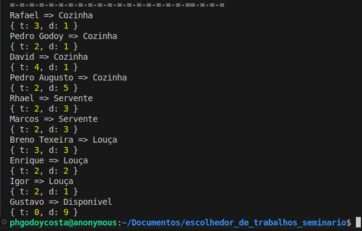

<div align="center">
    
</div>

# Escolhedores de Tarefas Seminário

> Ele é um programa que usa do Algorítimo Húngaro para melhor distribuir nossas tarefas semanais dentro do seminário entre **X** pessoas para **Y** trabalhos.


## 🎥 Funcionamento do projeto

Para saber melhor qual foi a ideia, etapas de desenvolvimento, como cheguei nessa solução e como esse projeto ajudou meus dias no seminário, leia essa matéria completa onde explico tudo isso no meu site portfólio:

**Link da Matéria Completa:** [https://phgodoycosta.com.br/projeto/escolhedor_tarefas_seminario](https://phgodoycosta.com.br/projeto/escolhedor_tarefas_seminario)

### 💻 Exemplo de Retorno

<div align="center">
    
</div>

## 📦 Instalação

```bash
# Clonar o repositório
git clone https://github.com/PHGodoyCosta/Escolhedor_tarefas_seminario
cd Escolhedor_tarefas_seminario

# Instalar dependências
npm install
# ou usando pnpm
pnpm install

# Configurar variáveis de ambiente
cp .env.example .env

# Iniciar o servidor em modo desenvolvimento
npm run dev
```